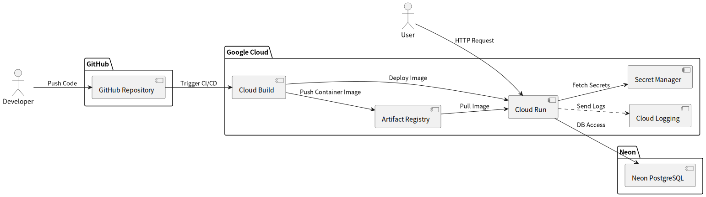

# 分散型図書管理アプリ

## 概要

分散型図書管理アプリを Django で開発します。

## 使用環境

### ■ OS

- 開発環境：

  - Windows 11 + WSL2（Ubuntu 24.04.1 LTS "Noble Numbat"）
  - Python 3.12.3（`venv` による仮想環境）
  - 主にローカルでのコード編集と動作確認に使用

- 実行環境（Docker）：
  - ベースイメージ：`python:3.13-slim-bookworm`（Debian Bookworm ベース）
  - 本番環境・CI/CD 環境で使用し、環境の一貫性を確保
  - ローカルでも Docker を利用可能な構成だが、現在は主に本番環境で稼働

### ■ プログラミング言語

- Python 3.12（開発環境、venv） / 3.13（Docker 実行環境）
- HTML/CSS/JavaScript

### ■ フレームワーク・ライブラリ

| 種類               | 名称                          | バージョン     | 備考                             |
| ------------------ | ----------------------------- | -------------- | -------------------------------- |
| Web フレームワーク | Django                        | 5.2            |                                  |
| フロントエンド     | Bootstrap (crispy-bootstrap5) | 5              | CDN 利用＋フォームスタイルに利用 |
| DB ドライバ        | psycopg                       | 3.2.9          | PostgreSQL 用                    |
| テスト             | pytest / pytest-django        | 8.4.1 / 4.11.1 |                                  |

### ■ ミドルウェア・その他

| 種類                     | 名称       | バージョン | 備考 |
| ------------------------ | ---------- | ---------- | ---- |
| アプリケーションサーバー | Gunicorn   | 23.0.0     |      |
| データベース             | PostgreSQL | -          |      |

## デプロイ・実行環境

- 本番環境 URL (Cloud Run): https://distributed-library-1066453624488.asia-northeast1.run.app/

  ※ Cloud Run はサーバレス環境のため、初回アクセス時にコールドスタートが発生し、約 10 秒程度の起動時間がかかる場合があります。
  また、起動後のレスポンスも 1〜3 秒ほどかかることがあります。あらかじめご了承ください。

  > 本番環境（Cloud Run）へのデプロイは、Google Cloud の Cloud Build により自動化されています。  
  > GitHub へのプッシュをトリガーに、`cloudbuild.yaml` が実行され、`docker/Dockerfile.prod` を用いてコンテナイメージをビルド・デプロイします。  
  > 起動処理には `entrypoint.sh` を使用しており、Django アプリの起動やマイグレーション、静的ファイル収集などの初期処理を含んでいます。

- 代替環境 URL (Render - Python 環境): https://distributed-library-2.onrender.com

  ※ Render の無料プランを使っており、初回起動に約 1 分程度かかる場合がありますが、起動後は比較的高速に応答します。

- 代替環境 URL (Render - Docker 環境): https://distributed-library-q6cj.onrender.com

  ※ Docker 環境でも同様に初回起動に時間がかかる場合がありますが、動作環境の違いを確認いただけます。

- 備考: テスト用アカウント情報（以下のアカウントはテスト目的で用意されたものです）

  | 役割           | ユーザー名 | パスワード          |
  | -------------- | ---------- | ------------------- |
  | 一般ユーザー 1 | general1   | dev_general1_123    |
  | 一般ユーザー 2 | general2   | dev_general2_123    |
  | 司書           | librarian1 | dev_librarian1_123! |

  > ※これらのアカウントはテスト用です。本番環境の重要な情報は含まれていません。

  > 一般ユーザーについては、上記の `general1` や `general2` アカウントを利用していただいても構いませんし、  
  > 画面上の「新規登録」機能から自由にアカウントを作成いただいても問題ありません。  
  > 一方、**「司書」アカウントはユーザー画面から新規作成できないため**、テストには上記の `librarian1` アカウントをご利用ください。

## システム構成図（Cloud Run デプロイ構成）

本プロジェクトは主要な本番環境として Google Cloud の Cloud Run を用いており、サーバーレス環境での運用を行っています。 以下に、Cloud Run 環境へのデプロイを含むシステム全体の構成図を示します。



PlantUML のソースコードは[こちら](docs/system_architecture/system_architecture.pu)にあります。

## 進捗状況

- 進捗状況は[こちら](CHANGELOG.md)をご覧ください。

## 開発ドキュメント

- 開発ドキュメントは[こちら](docs/README.md)をご覧ください。

## 必要な環境・依存関係

- **Python バージョン**:

  - 開発環境（venv）: Python 3.12（動作確認済み）
  - Docker 実行環境: Python 3.13（ベースイメージ：`python:3.13-slim-bookworm`）

- **主な依存ライブラリ**（詳細は `requirements.txt` を参照）:
  - Django（バージョン 5.2）
  - **テスト関連ライブラリ**:
    - pytest 8.4.1
    - pytest-django 4.11.1

## セットアップ手順

本プロジェクトは、以下の 2 通りの方法で開発環境を構築できます：

- Python の仮想環境（venv）を使う方法

- Docker / Docker Compose を使う方法（本番と近い環境での動作確認にも適しています）

### 1. Python 仮想環境（venv）を使ったセットアップ

```bash
# Pythonの仮想環境を作成します（初回のみ）
python3 -m venv .venv
# 仮想環境を有効化します
source .venv/bin/activate
# 必要なライブラリをインストールします
pip install -r requirements.txt
# マイグレーションを行います。
python manage.py migrate
# ローカルサーバーを起動します。
python manage.py runserver
# その後、ブラウザで`http://127.0.0.1:8000/`にアクセスしてください。
```

### 2. Docker を使ったセットアップ（開発確認用）

> ※ docker-compose.yml および docker/Dockerfile.dev を使用しています。

```bash
# 初回ビルドとコンテナ起動
docker compose up --build

# 2回目以降（ビルド不要な場合）
docker compose up
```

> ※ コンテナ起動直後は、マイグレーションが未実行のためデータベースの機能が正しく動作しません。  
> 必ず `python manage.py migrate` を実行してください。

- 初回マイグレーション

```bash
# 別ターミナルでコンテナに接続
docker compose exec web bash

# マイグレーションを実行
python manage.py migrate
```

ブラウザで `http://127.0.0.1:8000/`（または `http://localhost:8000/`）にアクセスしてください。

### 環境変数設定 (.env ファイル)

本プロジェクトでは `environs` を使って環境変数を読み込みます。  
以下の内容を `.env` ファイルとしてプロジェクトルートに用意してください。

```env
# Djangoのシークレットキー（必須）
SECRET_KEY=your-secret-key

# 開発中は True、本番は False
DEBUG=True

# SQLite を使う場合のデータベースURL
DATABASE_URL=sqlite:///db.sqlite3
```

> ※ 本番運用する場合は ALLOWED_HOSTS や 必要に応じて CSRF_TRUSTED_ORIGINS などの設定も追加してください。

> ※ SECRET_KEY は安全なランダム文字列である必要があります。以下のコマンドで生成できます：

```bash
python -c "import secrets; print(secrets.token_urlsafe())"
```

> 生成された文字列を `.env` の `SECRET_KEY` にコピーしてください。

## テスト

本プロジェクトでは、主に以下のテストツールを使用しています：

- **pytest**: ユニットテスト・統合テストの実行に使用
- **pytest-django**: Django 向けの拡張
- **unittest**: 一部のテストケースに使用
- **coverage.py**: テストカバレッジの測定に使用（オプション）

### テストの実行方法

#### ローカル（venv）での実行

```bash
pytest
```

#### Docker コンテナ上での実行

```bash
docker compose exec web pytest
```

### テストカバレッジ

`coverage` を用いたテストカバレッジは現在 **約 99%** を達成しています。

```bash
coverage run -m pytest
coverage report
```
