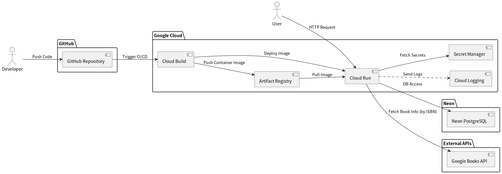

# 分散型図書管理アプリ

[](https://github.com/tomoki-shiozaki/distributed-library/actions/workflows/ci.yml)
[](https://codecov.io/github/tomoki-shiozaki/distributed-library)
[](LICENSE)

## 概要

本アプリは、図書館向けの管理システムです。書籍の登録、一般利用者による貸出・予約・返却機能などを備えています。  
企業のビル内の各所に書籍が分散して保管されているケースを想定し、これらを一元的に管理するために設計されています。  
分散した書籍の貸出・予約状況をオンラインで管理できるため、利用者・管理者の双方にとって高い利便性を提供します。

このアプリは、就労移行支援の訓練の一環として開発しましたが、実際の業務運用を意識した実践的な機能を数多く盛り込んでいます。  
たとえば、貸出や予約時には利用者単位でロック処理を行うなど、現場を想定した堅牢な仕様となっています。

アプリは Google Cloud の **Cloud Run** 上にデプロイされており、以下の URL から実際に操作をお試しいただけます：

👉 [https://distributed-library-1066453624488.asia-northeast1.run.app/](https://distributed-library-1066453624488.asia-northeast1.run.app/)

※初回アクセス時は、サーバレス環境の特性により起動に約 10 秒ほどかかる場合があります。ご了承ください。

🔑 また、操作を試せる **テスト用のログインアカウント（一般ユーザー／司書）** もご用意しています。  
ログイン情報の詳細は、[「テスト用アカウント情報」](#テスト用アカウント情報) セクションをご覧ください。

📄 操作方法に不明な点がある場合は、以下のマニュアルをご参照ください：  
[操作マニュアル（manual.md）](docs/manual/manual.md)

## 目次

- [分散型図書管理アプリ](#分散型図書管理アプリ)
  - [概要](#概要)
  - [目次](#目次)
  - [目的](#目的)
  - [使用環境](#使用環境)
    - [OS](#os)
    - [プログラミング言語](#プログラミング言語)
    - [フレームワークとライブラリ](#フレームワークとライブラリ)
    - [ミドルウェアおよびその他](#ミドルウェアおよびその他)
  - [デプロイと実行環境](#デプロイと実行環境)
    - [本番環境（Cloud Run）](#本番環境cloud-run)
      - [デプロイ方式（自動化）](#デプロイ方式自動化)
    - [テスト用アカウント情報](#テスト用アカウント情報)
      - [アカウントに関する補足](#アカウントに関する補足)
    - [代替環境（Render）](#代替環境render)
      - [Render - Python 環境](#render---python-環境)
      - [Render - Docker 環境](#render---docker-環境)
  - [システム構成図（Cloud Run デプロイ構成）](#システム構成図cloud-run-デプロイ構成)
  - [操作マニュアル](#操作マニュアル)
  - [進捗状況](#進捗状況)
  - [開発ドキュメント](#開発ドキュメント)
  - [必要な環境と依存関係](#必要な環境と依存関係)
  - [セットアップ手順](#セットアップ手順)
    - [1. Python 仮想環境（venv）を使ったセットアップ](#1-python-仮想環境venvを使ったセットアップ)
    - [2. Docker を使ったセットアップ（開発確認用）](#2-docker-を使ったセットアップ開発確認用)
    - [環境変数設定 (.env ファイル)](#環境変数設定-env-ファイル)
  - [テスト](#テスト)
    - [テストの実行方法](#テストの実行方法)
      - [ローカル（venv）での実行](#ローカルvenvでの実行)
      - [Docker コンテナ上での実行](#docker-コンテナ上での実行)
    - [テストカバレッジ](#テストカバレッジ)
    - [CI でのテストとカバレッジ](#ci-でのテストとカバレッジ)
  - [ライセンス](#ライセンス)
  - [作者 / Author](#作者--author)

## 目的

本アプリの開発目的は、業務現場で実際に使われるような、実践的な図書管理アプリを作成することです。
実務に近い機能や運用を想定した仕様設計に重点を置いています。

## 使用環境

### OS

- 開発環境：

  - Windows 11 + WSL2（Ubuntu 24.04.1 LTS "Noble Numbat"）
  - Python 3.12.3（`venv` による仮想環境）
  - 主にローカルでのコード編集と動作確認に使用

- 実行環境（Docker）：
  - ベースイメージ：`python:3.13-slim-bookworm`（Debian Bookworm ベース）
  - 本番環境・CI/CD 環境で使用し、環境の一貫性を確保
  - ローカルでも Docker を利用可能な構成だが、現在は主に本番環境で稼働

### プログラミング言語

- Python 3.12（開発環境、venv） / 3.13（Docker 実行環境）
- HTML/CSS/JavaScript

### フレームワークとライブラリ

| 種類               | 名称                          | バージョン     | 備考                             |
| ------------------ | ----------------------------- | -------------- | -------------------------------- |
| Web フレームワーク | Django                        | 5.2.5          |                                  |
| フロントエンド     | Bootstrap (crispy-bootstrap5) | 5              | CDN 利用＋フォームスタイルに利用 |
| DB ドライバ        | psycopg                       | 3.2.9          | PostgreSQL 用                    |
| テスト             | pytest / pytest-django        | 8.4.1 / 4.11.1 |                                  |

### ミドルウェアおよびその他

| 種類                     | 名称       | バージョン | 備考                       |
| ------------------------ | ---------- | ---------- | -------------------------- |
| アプリケーションサーバー | Gunicorn   | 23.0.0     |                            |
| データベース             | PostgreSQL | -          | 開発環境では SQLite を利用 |

## デプロイと実行環境

### 本番環境（Cloud Run）

- URL: https://distributed-library-1066453624488.asia-northeast1.run.app/

※ Cloud Run はサーバレス環境のため、**初回アクセス時に約 10 秒の起動時間（コールドスタート）が発生する**場合があります。  
また、通常のレスポンスも 1〜3 秒ほどかかる場合があります。

#### デプロイ方式（自動化）

本番環境へのデプロイは、**Google Cloud の Cloud Build** により自動化されています。

- GitHub へのプッシュをトリガーに、`cloudbuild.yaml` が実行されます。
- `docker/Dockerfile.prod` を用いて、コンテナイメージをビルド・デプロイ。
- 起動処理には `docker/entrypoint.sh` を使用し、以下の初期処理を実行：
  - マイグレーション
  - 静的ファイルの収集
  - Django アプリの起動

---

### テスト用アカウント情報

以下のアカウントは、**本アプリを体験するためのテストアカウント**です。

| 役割           | ユーザー名   | パスワード            |
| -------------- | ------------ | --------------------- |
| 一般ユーザー 1 | `general1`   | `dev_general1_123`    |
| 一般ユーザー 2 | `general2`   | `dev_general2_123`    |
| 司書           | `librarian1` | `dev_librarian1_123!` |

> ⚠️ これらはテスト専用アカウントであり、本番環境の重要な情報は含まれていません。

#### アカウントに関する補足

- **一般ユーザー**は、`general1` または `general2` を使用してもよいですし、  
  アプリ画面上の「新規登録」から自由にアカウントを作成していただいても構いません。
- 登録時には、実在しないメールアドレス（例: `user@example.com`）を使用して構いません。  
  **メール確認や認証は行われません**。
- パスワードも、テスト目的で適当な文字列を使用可能です。

- 一方、**司書アカウントはユーザー画面から新規作成できません**。  
  テストの際は、上記の `librarian1` アカウントをご利用ください。

---

### 代替環境（Render）

#### Render - Python 環境

- URL: https://distributed-library-2.onrender.com
- 備考: 無料プランを使用しており、**初回起動に約 1 分**ほどかかる場合がありますが、起動後は比較的高速です。

#### Render - Docker 環境

- URL: https://distributed-library-q6cj.onrender.com
- 備考: Docker コンテナを使用。Python 環境と同様、初回起動に時間がかかる場合がありますが、動作確認用途として提供しています。

## システム構成図（Cloud Run デプロイ構成）

本プロジェクトは主要な本番環境として Google Cloud の Cloud Run を用いており、サーバーレス環境での運用を行っています。 以下に、Cloud Run 環境へのデプロイを含むシステム全体の構成図を示します。

**画像を右クリックして、「新しいタブで画像を開く」としていただくと、拡大された画像がご覧になれます。**  


PlantUML のソースコードは[こちら](docs/system_architecture/system_architecture.pu)にあります。

## 操作マニュアル

本アプリの操作方法については、以下のマニュアルをご覧ください：

📄 [docs/manual/manual.md](docs/manual/manual.md)

このマニュアルでは以下を説明しています：

- 一般ユーザー・司書の役割と違い
- アカウント関連操作（新規登録、ログイン、ログアウト、パスワード変更）
- 書籍の検索、貸出、返却、予約(一般ユーザー向け)
- 書籍の登録（司書向け）
- よくある質問（FAQ）

はじめてアプリを利用する方は、このマニュアルの内容に一度目を通しておくとスムーズです。

## 進捗状況

- 進捗状況は[こちら](CHANGELOG.md)をご覧ください。

## 開発ドキュメント

- 開発ドキュメントは[こちら](docs/README.md)をご覧ください。  
  本ドキュメントは、**企画・要件・設計**の各フェーズにわたる開発資料をまとめたものです。  
  以下のような設計資料を含んでいます：

  - ER 図（エンティティ・リレーション図）
  - ユースケース図
  - 画面遷移図
  - その他、システム設計に関する図表や補足説明

## 必要な環境と依存関係

- **Python バージョン**:

  - 開発環境（venv）: Python 3.12（動作確認済み）
  - Docker 実行環境: Python 3.13（ベースイメージ：`python:3.13-slim-bookworm`）

- **主な依存ライブラリ**（詳細は `requirements.txt` を参照）:
  - Django（バージョン 5.2）
  - **テスト関連ライブラリ**:
    - pytest 8.4.1
    - pytest-django 4.11.1

## セットアップ手順

本プロジェクトは、以下の 2 通りの方法で開発環境を構築できます：

- Python の仮想環境（venv）を使う方法

- Docker / Docker Compose を使う方法（本番と近い環境での動作確認にも適しています）

### 1. Python 仮想環境（venv）を使ったセットアップ

```bash
# Pythonの仮想環境を作成します（初回のみ）
python3 -m venv .venv
# 仮想環境を有効化します
source .venv/bin/activate
# 必要なライブラリをインストールします
pip install -r requirements.txt
# マイグレーションを行います。
python manage.py migrate
# ローカルサーバーを起動します。
python manage.py runserver
# その後、ブラウザで`http://127.0.0.1:8000/`にアクセスしてください。
```

### 2. Docker を使ったセットアップ（開発確認用）

> ※ docker-compose.yml および docker/Dockerfile.dev を使用しています。

```bash
# 初回ビルドとコンテナ起動
docker compose up --build

# 2回目以降（ビルド不要な場合）
docker compose up
```

> ※ コンテナ起動直後は、マイグレーションが未実行のためデータベースの機能が正しく動作しません。  
> 必ず `python manage.py migrate` を実行してください。

- 初回マイグレーション

```bash
# 別ターミナルでコンテナに接続
docker compose exec web bash

# マイグレーションを実行
python manage.py migrate
```

ブラウザで `http://127.0.0.1:8000/`（または `http://localhost:8000/`）にアクセスしてください。

### 環境変数設定 (.env ファイル)

本プロジェクトでは `environs` を使って環境変数を読み込みます。  
以下の内容を `.env` ファイルとしてプロジェクトルートに用意してください。

```env
# Djangoのシークレットキー（必須）
SECRET_KEY=your-secret-key

# 開発中は True、本番は False
DEBUG=True

# SQLite を使う場合のデータベースURL
DATABASE_URL=sqlite:///db.sqlite3
```

> ※ 本番運用する場合は ALLOWED_HOSTS や 必要に応じて CSRF_TRUSTED_ORIGINS などの設定も追加してください。

> ※ SECRET_KEY は安全なランダム文字列である必要があります。以下のコマンドで生成できます：

```bash
python -c "import secrets; print(secrets.token_urlsafe())"
```

> 生成された文字列を `.env` の `SECRET_KEY` にコピーしてください。

## テスト

本プロジェクトでは、主に以下のテストツールを使用しています：

- **pytest**: ユニットテスト・統合テストの実行に使用
- **pytest-django**: Django 向けの拡張
- **unittest**: 一部のテストケースに使用
- **coverage.py**: テストカバレッジの測定に使用（オプション）

### テストの実行方法

#### ローカル（venv）での実行

```bash
pytest
```

#### Docker コンテナ上での実行

```bash
docker compose exec web pytest
```

### テストカバレッジ

`coverage` を用いたテストカバレッジは現在 **約 99%** を達成しています。

```bash
coverage run -m pytest
coverage report
```

### CI でのテストとカバレッジ

本プロジェクトでは、GitHub Actions を使った CI パイプラインで

- テストの自動実行
- テストカバレッジの計測および報告（Codecov 連携）

を行っています。  
これにより、コードの品質とテスト網羅率を継続的にモニタリングします。

[GitHub Actions](https://github.com/tomoki-shiozaki/distributed-library/actions)  
[Codecov](https://codecov.io/gh/tomoki-shiozaki/distributed-library)

## ライセンス

このプロジェクトは [MIT ライセンス](LICENSE) のもとで公開されています。

## 作者 / Author

塩崎 友貴 (Tomoki Shiozaki)  
[GitHub アカウント](https://github.com/tomoki-shiozaki)
