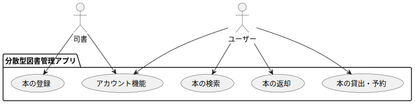

# 📄 分散型図書管理アプリ開発ドキュメント（v0.1.x）

---

## 1. プロジェクト概要

- **プロジェクト名：**  分散型図書管理アプリ開発プロジェクト
- **前提：** ビル内に数千冊の本が保管されている。これらの本を有効に活用したい。
    - 基本データ
        - ビル専有フロア数：２０フロア
        - 社員数：約４０００人
        - 本棚数：約５０箇所
        - 総冊数（推定）：１５０００冊

- **開発目的：**  これらの本を、分散型図書館サービスを用いて社員に利用してもらう。分散型図書館とは、図書館の機能や資料を複数の場所に分散して提供する図書館のことである。この図書館は、物理的な面とデジタル的な面を持っているが、このプロジェクトでは、デジタルの領域を扱う。つまり、ビル内のすべての本を、統一して管理するアプリを開発する。

- **ターゲットユーザー：**  ビルの本を利用する社員。社員１人につき１アカウントを想定。

- **利用シーンの想定：**  
    - 本の登録
    - 本の検索
    - 貸出返却履歴確認
    - 貸出情報入力/表示
- **開発スコープ：**

    作成日：2025-04-16
    作成者：塩崎友貴

    ---
    
    - 対象範囲（スコープに含まれる機能）
        - ユーザー登録、ログイン、ログアウト
        - 本の登録(本のデータを登録。ISBNを手入力すると、タイトルなどを取得する)
        - 蔵書の一覧表示、検索機能
        - 貸出返却履歴保存
        - 貸出情報入力、貸出情報表示
        - レスポンシブデザイン

    - スコープ外機能で、今後追加を検討するもののリスト(ver0.1以降)  
        - 本の登録（ISBNをスキャンして、タイトルなどを取得する）

- **開発スケジュール（マイルストーン）：**

    作成日：2025-04-16
    作成者：塩崎友貴

    ---

    | フェーズ         | 期間              | 作業内容                             |
    |------------------|-------------------|--------------------------------------|
    | 要件定義         | 2025/04/16〜2025/04/25      | 機能の洗い出し、構想固め             |
    | 設計             | 2025/04/28〜2025/05/09      | ユースケース図、画面遷移図、ER等の設計図            |
    | 実装             | 2025/05/12〜2025/06/13     | フロント・バックエンド実装           |
    | テスト           | 2025/06/16〜2025/06/20      | 動作検証・バグ修正                   |
    | デモ版レビュー | 2025/06/23〜2025/06/27 | デモ版レビュー、修正 |
    | 資料作成 | 2025/06/30～2025/07/04 | 使用環境、操作マニュアルなどの資料作成 |
    | 完成版レビュー   | 2025/07/07〜2025/07/11      | 最終修正                    |

---

## 2. 要件定義

### 2.1 機能要件

| No | 機能名         | 概要                                                   |
|----|----------------|--------------------------------------------------------|
| 1  | ユーザー登録     | ユーザーがメールアドレス、ユーザー名とパスワードを登録 |
| 2  | ログイン         | ユーザーがユーザー名とパスワードでログインできる                      |
| 3  | ログアウト       | ログイン中のユーザーがログアウトする                   |
| 4  | パスワード変更   | メールアドレスを使って、パスワードを変更できる         |
| 5  | 本の登録     | 司書？（管理者？）が本データを登録する         |
| 6  | 本の一覧表示     | ユーザーが蔵書の一覧を確認できる         |
| 7  | 本の検索     | 本を検索し、検索結果を表示する                |
| 8  | 貸し出し状況確認     | 貸出状況確認/予約・貸出ページに移動/レビューや関連書籍表示                     |
| 9  | 貸出・予約     | 日程を決めて、貸出や予約を行う                      |
| 10 | 返却     | 貸出中の本を返却する                    |
| 11 | 貸出・予約完了表示         | 本の貸出・予約完了を伝える/本の場所を記載する                                 |

### 2.2 非機能要件
 
- **対応ブラウザ / デバイス：** 
    - レスポンシブデザインとする

### 2.3 ユースケース図
