# 分散型図書管理アプリ操作マニュアル

---

## 1. 概要

このマニュアルでは、分散型図書管理アプリの基本的な操作について説明します。  
司書アカウントと一般ユーザーアカウントがあります。司書は本の登録を行い、一般ユーザーは本の検索、貸出、予約、返却などを操作できます。  
不明点などは管理者に問い合わせてください。

---

## 2. ロール（役割）

| ロール       | 主な権限・機能                                                                       |
| ------------ | ------------------------------------------------------------------------------------ |
| 司書         | 本の登録                                                                             |
| 一般ユーザー | 本の検索、貸出、予約、自分の貸出・予約状況の確認、返却、予約取消し、予約資料の貸出し |

---

## 3. 新規登録・ログイン・ログアウト

### 3.1 新規登録

- 一般ユーザーアカウントは、「新規登録」から登録してください。
- 司書アカウントは管理者が作成します。

### 3.2 ログイン

1. ホームページ([https://distributed-library-1066453624488.asia-northeast1.run.app/](https://distributed-library-1066453624488.asia-northeast1.run.app/) )にアクセスし、「ログイン」ボタンをクリックしてください。
   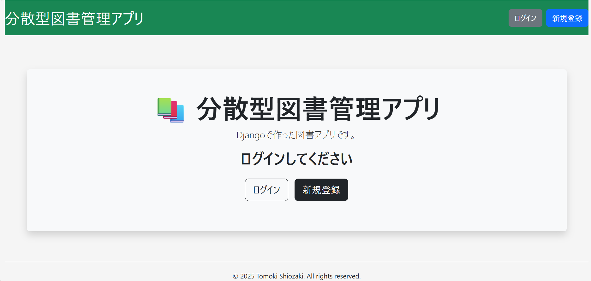
2. ユーザー名とパスワードを入力し、ログインしてください。
   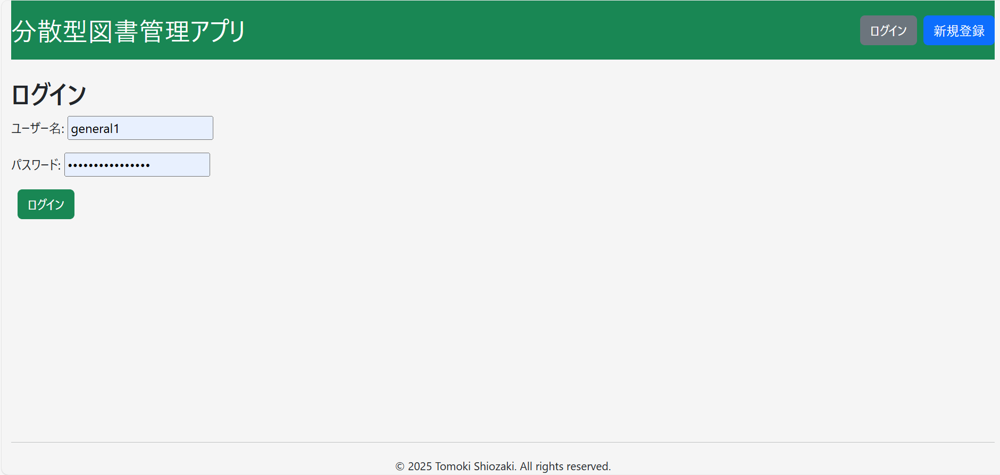

### 3.3 ログアウト

1. 画面右上のユーザー名をクリックしてください。すると、「パスワード変更」と「ログアウト」のボタンが表示されます。

   ログアウト画面の例：

   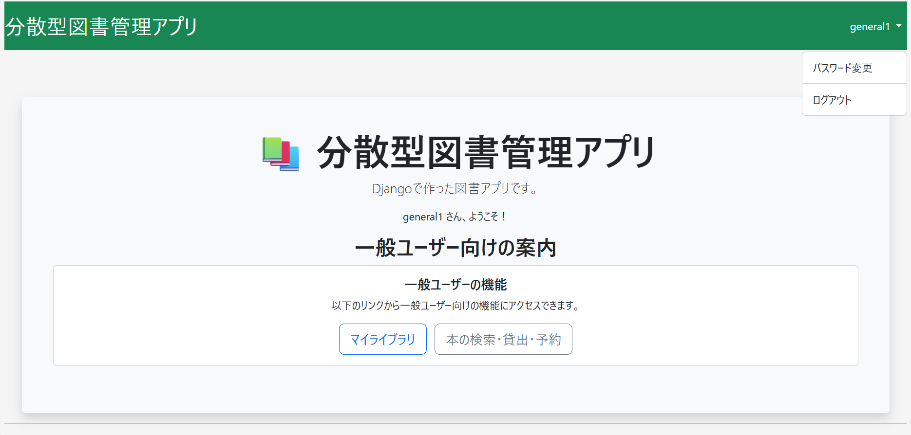

2. 「ログアウト」ボタンをクリックすると、ログアウトされてホーム画面に遷移します。

### 3.4 パスワード変更

1. 画面右上のユーザー名をクリックしてください。すると、「パスワード変更」と「ログアウト」のボタンが表示されます。「パスワード変更」ボタンをクリックしてください。

2. 元のパスワードを入力したうえで、新しいパスワードを２回入力し、「パスワード変更」ボタンをクリックしてください。

   パスワード変更画面の例：

   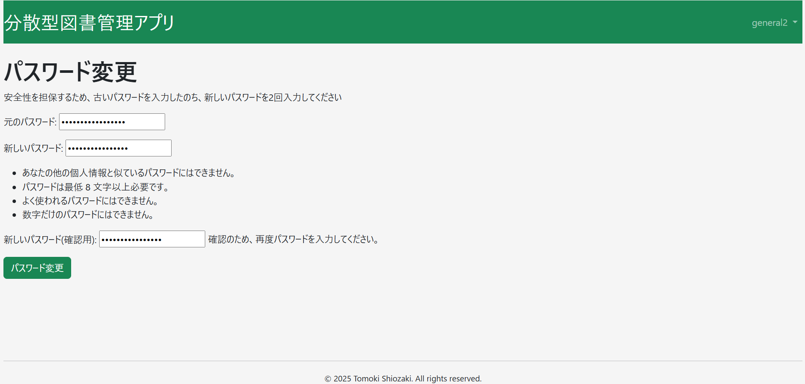

3. パスワード変更が成功すると、「パスワード変更が完了しました」と表示されます。

   パスワード変更完了画面の例：

   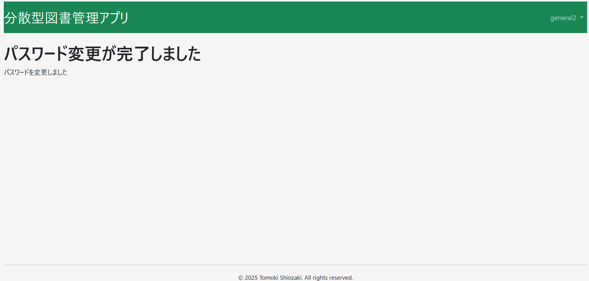

---

## 4. 司書向け操作手順

### 4.1 本の登録

1. ダッシュボードの「本の管理」メニューをクリックします。
2. 「新規登録」ボタンをクリックしてください。
3. 書籍情報（タイトル、著者、ISBN、カテゴリなど）を入力します。
4. 「保存」ボタンを押して登録完了です。

### 4.2 貸出処理

1. 「貸出管理」メニューを開きます。
2. 貸出するユーザーと貸出したい本を選択します。
3. 貸出日・返却予定日を設定して「貸出登録」ボタンをクリックします。
4. 貸出が正常に登録されると、ユーザーに通知が行きます。

### 4.3 予約資料の貸出

1. 予約された資料の一覧から貸出処理を行います。
2. 対象資料の「貸出」ボタンをクリックして処理してください。

---

## 5. 一般ユーザー向け操作手順

一般ユーザーが利用できる主な機能は以下の通りです：

1. 本の検索、貸出、予約
2. マイライブラリ機能（自分の貸出・予約状況の確認、返却、予約取り消し、予約資料の貸出）

各機能には専用のボタンが用意されています。

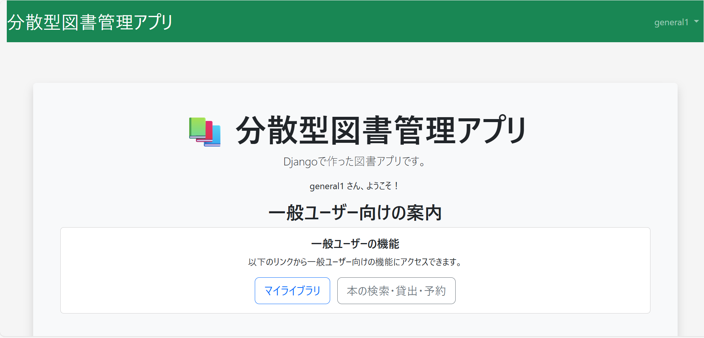

---

### 5.1 本の検索・貸出・予約

本の貸出や予約は、本を検索した後に行います。  
まずは、ホーム画面の「本の検索・貸出・予約」ボタンをクリックしてください。

---

### 5.1.1 本の検索

1. ホーム画面の「本を検索」欄に、キーワード（タイトルや著者名など）を入力して検索ボタンを押してください。

   検索条件の仕様は以下の通りです：

   - **部分一致**（入力した文字列が、対象の中に**含まれていれば**該当と見なされます）
   - **AND 検索**（複数の条件を入力した場合、それらをすべて満たす本のみがヒットします）
   - **大文字と小文字は区別されません**
   - **検索条件を何も指定しなければ、すべての所蔵図書が表示されます**

   検索画面の例：

   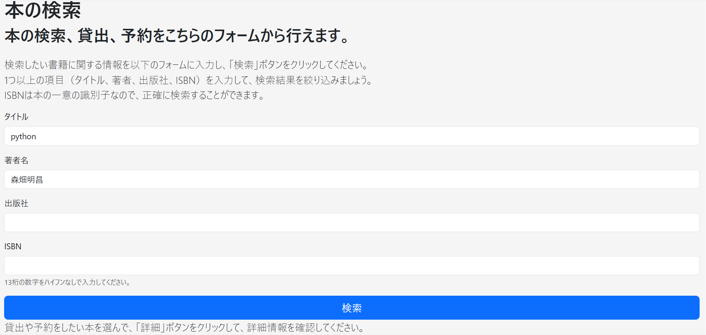

2. 検索結果の一覧が表示されます。気になる本を見つけたら、一覧の各行の右端にある「詳細」ボタンをクリックしてください。

   検索結果一覧の例：

   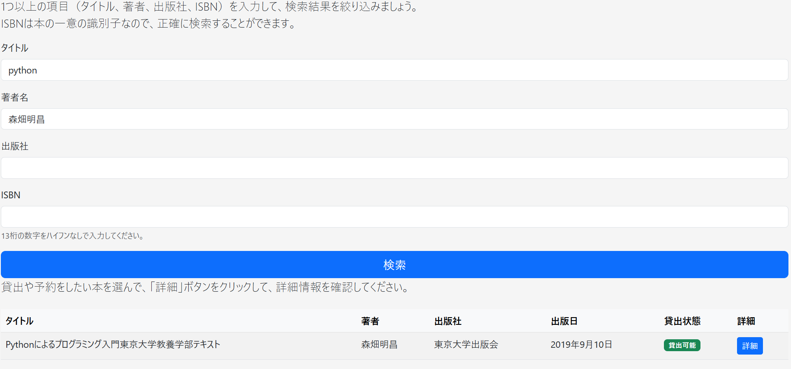

3. 選択した本の詳細情報画面が表示されます。

   本の詳細画面の例：

   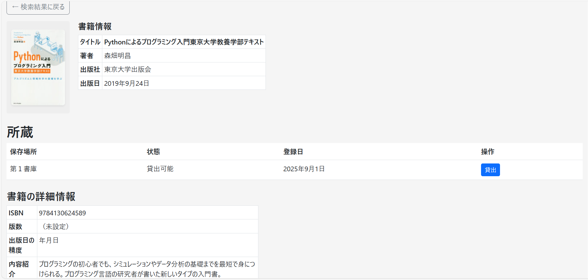

### 5.1.2 貸出

1. 本の詳細画面で、貸出したい蔵書の「貸出」ボタンをクリックします。

   本の貸出手続き画面の例：

   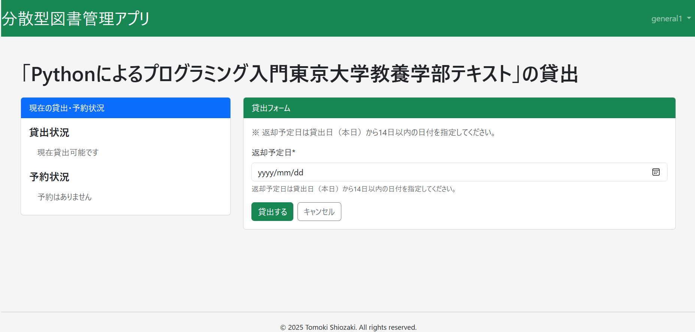

2. 「現在の貸出・予約状況」欄を確認し、他の利用者の予約期間と重ならないように注意してください。  
   次に、「貸出フォーム」欄の「返却予定日」フィールドに返却予定日を入力します。

   入力する際は、**返却予定日欄の右端にあるカレンダーアイコンをクリック**してください。  
   カレンダーが表示されるので、そこから返却予定日を選択できます。

   貸出フォーム入力画面の例：

   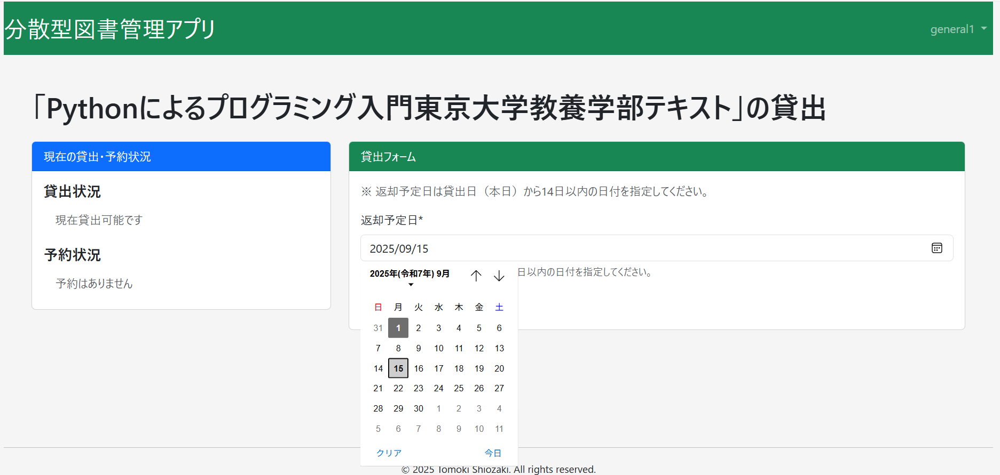

3. 貸出期間は、**貸出日（本日）から最長 14 日間**です。  
   また、**1 ユーザーあたり最大 10 冊まで**貸出可能です。

4. 貸出が完了すると、自動的に本の詳細画面に戻り、画面上部に「**貸出処理が完了しました**」という通知が表示されます。

   貸出処理完了時の画面例：

   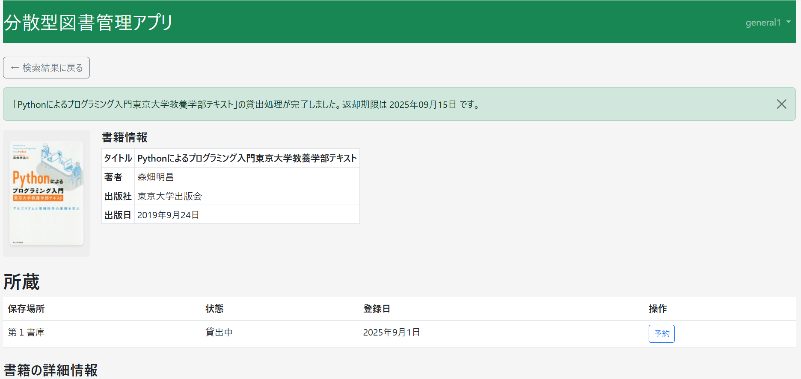

### 5.1.3 予約

1. 貸出中の蔵書は、本の詳細情報画面で「貸出中」と表示されています。

   本の詳細画面の例：

   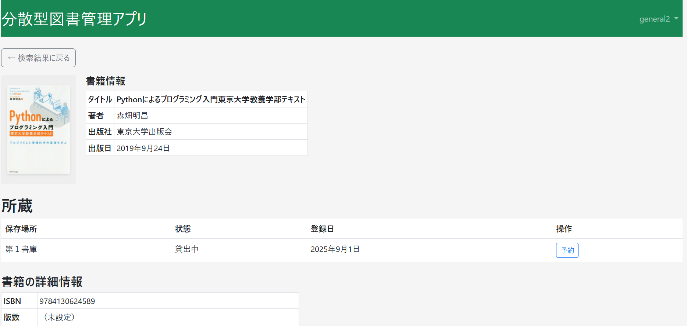

2. 予約したい蔵書の「予約」ボタンをクリックしてください。

   予約フォーム入力画面の例：

   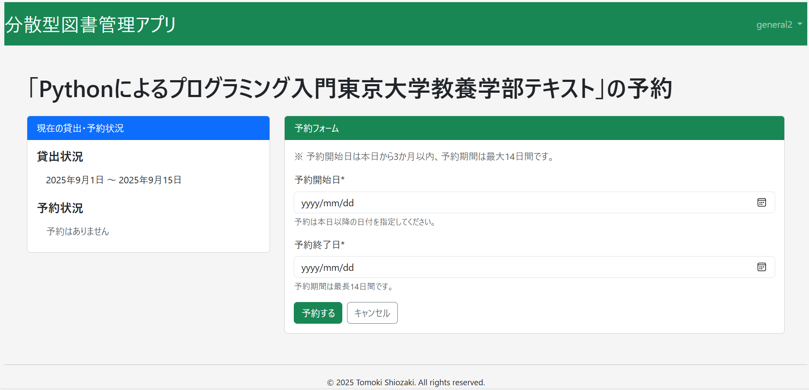

3. 「現在の貸出・予約状況」欄を確認し、他の利用者の貸出・予約期間と重ならないように注意してください。  
   次に、「予約フォーム」欄の「予約開始日」、「予約終了日」フィールドに予約開始日、予約終了日を入力します。

   入力する際は、**予約開始日、予約終了日欄の右端にあるカレンダーアイコンをクリック**してください。  
   カレンダーが表示されるので、そこから返却予定日を選択できます。

   予約フォーム入力画面の例：

   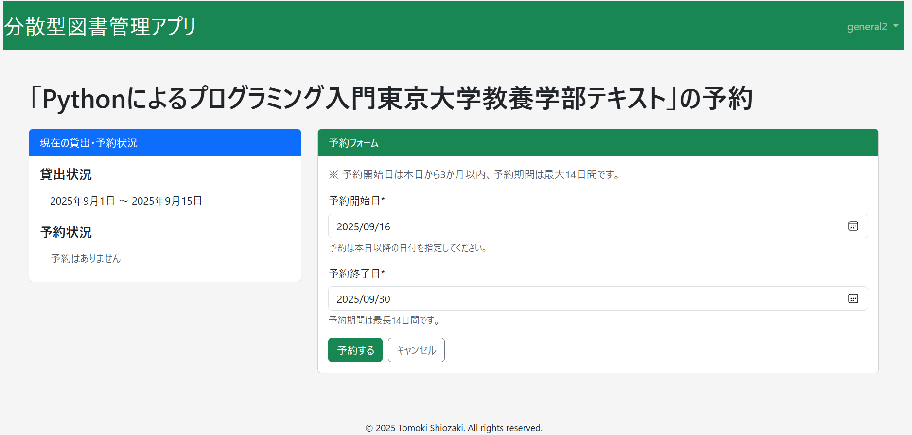

4. 予約期間は、**最長 14 日間**です。  
   また、**1 ユーザーあたり最大 7 冊まで**予約可能です。

5. 予約が完了すると、自動的に本の詳細画面に戻り、画面上部に「**予約処理が完了しました**」という通知が表示されます。

   予約処理完了時の画面例：

   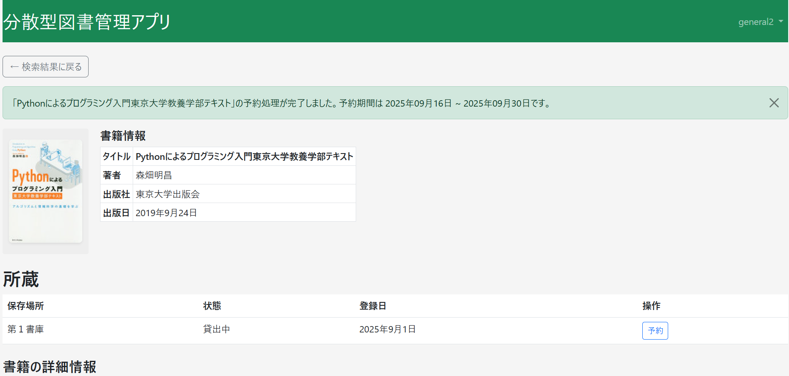

### 5.5 自分の貸出・予約状況の確認

1. マイページから「貸出中の本」や「予約中の本」を確認できます。

### 5.6 返却

1. 貸出中の本の返却時は、返却操作を行ってください。
2. 返却処理が完了すると貸出リストから消えます。

### 5.7 予約の取り消し

1. マイページの予約一覧から「キャンセル」ボタンを押すと予約を取り消せます。

---

## 6. 管理者向け操作手順

1. Django の管理画面にログインします（例: `/admin`）。
2. 司書アカウントの作成・編集・削除を行います。
3. サイト全体の設定やユーザー権限管理もこちらで行います。

---

## 7. よくある質問（FAQ）

- **Q: パスワードを忘れた場合は？**  
  A: 司書または管理者に問い合わせてリセット依頼をしてください。

- **Q: 新規登録できない場合は？**  
  A: サイト管理者に登録権限の有無を確認してください。

---

## 8. サポート連絡先

- 何か問題があれば、以下のメールまでお問い合わせください。  
  support@example.com

---

## 9. ライセンス

このプロジェクトは [MIT ライセンス](LICENSE) のもとで公開されています。

---

## 10. 作者 / Author

塩崎 友貴 (Tomoki Shiozaki)  
[GitHub アカウント](https://github.com/tomoki-shiozaki)
