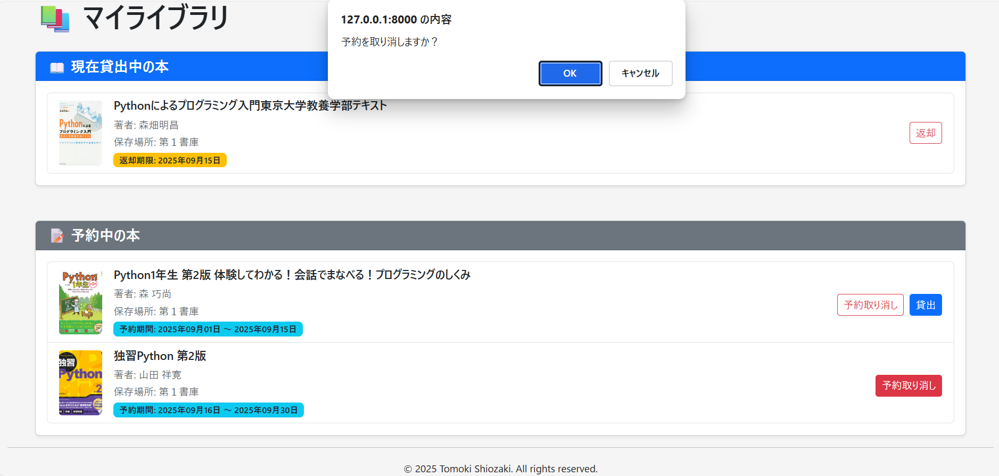

# 分散型図書管理アプリ操作マニュアル

---

## 1. 概要

このマニュアルでは、分散型図書管理アプリの基本的な操作について説明します。  
司書アカウントと一般ユーザーアカウントがあります。司書は本の登録を行い、一般ユーザーは本の検索、貸出、予約、返却などを操作できます。

また、本システムには管理者（システム管理者）が存在し、システム全体の設定やユーザー管理などを担当しています。
不明点などは司書または管理者に問い合わせてください。
問い合わせは [サポート連絡先](#7-サポート連絡先) をご参照ください。

---

## 2. ロール（役割）

| ロール       | 主な権限・機能                                                                       |
| ------------ | ------------------------------------------------------------------------------------ |
| 司書         | 本の登録                                                                             |
| 一般ユーザー | 本の検索、貸出、予約、自分の貸出・予約状況の確認、返却、予約取消し、予約資料の貸出し |

---

## 3. アカウント関連操作（新規登録・ログイン・ログアウト・パスワード変更）

アカウント関連の操作は以下の通りです。

### ゲスト（未ログイン）の場合

- ホーム画面に「ログイン」「新規登録」ボタンがあります。
- また、画面右上にも「ログイン」「新規登録」ボタンが表示されています。

ホーム画面（ゲスト）の例：  

### ログイン後の場合

- 画面右上にユーザー名が表示されます。
- ユーザー名をクリックすると、ログアウトやパスワード変更などのメニューが表示されます。

右上のメニューの例（ログイン後）：  

### 3.1 新規登録

- 一般ユーザーアカウントは、画面の「新規登録」ボタンから登録できます。  
  登録フォームに必要事項を入力し、登録を完了してください。  
  登録が完了すると、ログイン画面に遷移します。

  

- 司書アカウントはセキュリティ上の理由から管理者が作成します。  
  司書アカウントを希望する場合は管理者にお問い合わせください。

### 3.2 ログイン

1. ホーム画面で「ログイン」ボタンをクリックしてください。
   
2. ユーザー名とパスワードを入力し、ログインしてください。
   

### 3.3 ログアウト

1. 画面右上のユーザー名をクリックしてください。すると、「パスワード変更」と「ログアウト」のボタンが表示されます。

   ログアウト画面の例：

   

2. 「ログアウト」ボタンをクリックすると、ログアウトされてホーム画面に遷移します。

### 3.4 パスワード変更

1. 画面右上のユーザー名をクリックしてください。すると、「パスワード変更」と「ログアウト」のボタンが表示されます。「パスワード変更」ボタンをクリックしてください。

2. 元のパスワードを入力したうえで、新しいパスワードを２回入力し、「パスワード変更」ボタンをクリックしてください。

   パスワード変更画面の例：

   

3. パスワード変更が成功すると、「パスワード変更が完了しました」と表示されます。

   パスワード変更完了画面の例：

   

---

## 4. 司書向け操作手順

司書が利用できる機能は、蔵書の登録です。

蔵書の登録には、専用のボタンが用意されています。

ホーム画面：

---

## 4.1 蔵書の登録

1. ホーム画面の「蔵書の登録」ボタンをクリックしてください。

2. ISBN 入力画面が表示されます。登録したい書籍の ISBN コードを入力し、「送信」ボタンを押してください。

   

3. システムは入力された ISBN をもとに蔵書データベースを検索します。

4. 【登録済みの場合】  
   蔵書の詳細情報登録画面に進みます（ステップ 6 へ）。

5. 【未登録の場合】  
    本の基本情報登録画面が表示されます。  
    システムは ISBN をもとに Google Books API を使用し、書籍情報を検索します。

   > 💡 **Google Books API とは？**  
   > Google が提供する書籍データベースで、ISBN をもとに書名や著者、出版社などの情報を自動で取得できます。

   - **Google Books API に該当情報がある場合**  
     書籍情報がフォームに **自動入力** されます。内容を確認し、必要に応じて修正してください。

     #### 🔎 補足：出版社・出版日の自動取得について

     Google Books API では、出版社名や出版日が取得できなかったり、不完全な形式で返されることがあります。

     - **出版社が空欄の場合**は、わかる範囲で入力してください。
     - **出版日が年月のみの場合**、システムは日付の「1 日」を補完して自動入力します（例：2020 年 7 月 → `2020-07-01`）。
     - このような場合、出版日の「精度」欄も「年月」に自動設定されます。
     - **正確な年月日が分かる場合**は、正確な出版日を入力し、精度を「年月日」に修正してください。

   - **Google Books API に該当情報がない場合**  
     書籍情報をすべて手入力してください。

   登録が完了すると、蔵書の詳細情報登録画面に進みます（ステップ 6 へ）。

---

#### 画面例：Google Books API に該当情報がある場合

- 上部：

  

- 中部：

  

- 下部：

  

6. 蔵書の情報登録画面で、保存場所や蔵書の状態（貸出可能、貸出中、廃棄済み）を選択してください。  
   入力後、「蔵書の登録」ボタンを押して蔵書情報を登録します。

   

7. 登録が完了すると、蔵書の登録の確認画面が表示されます。続けて蔵書を登録する場合は、「さらに蔵書を登録する」ボタンをクリックしてください。

   

---

## 5. 一般ユーザー向け操作手順

一般ユーザーが利用できる主な機能は以下の通りです：

1. 本の検索、貸出、予約
2. マイライブラリ機能（自分の貸出・予約状況の確認、返却、予約取り消し、予約資料の貸出）

各機能には専用のボタンが用意されています。

ホーム画面：

---

### 5.1 本の検索・貸出・予約

本の貸出や予約は、本を検索した後に行います。  
まずは、ホーム画面の「本の検索・貸出・予約」ボタンをクリックしてください。

---

### 5.1.1 本の検索

1. ホーム画面の「本を検索」欄に、キーワード（タイトルや著者名など）を入力して検索ボタンを押してください。

   検索条件の仕様は以下の通りです：

   - **部分一致**（入力した文字列が、対象の中に**含まれていれば**該当と見なされます）
   - **AND 検索**（複数の条件を入力した場合、それらをすべて満たす本のみがヒットします）
   - **大文字と小文字は区別されません**
   - **検索条件を何も指定しなければ、すべての所蔵図書が表示されます**

   検索画面の例：

   

2. 検索結果の一覧が表示されます。気になる本を見つけたら、一覧の各行の右端にある「詳細」ボタンをクリックしてください。

   検索結果一覧の例：

   

3. 選択した本の詳細情報画面が表示されます。

   本の詳細画面の例：

   

### 5.1.2 貸出

1. 本の詳細画面で、貸出したい蔵書の「貸出」ボタンをクリックします。

   本の貸出手続き画面の例：

   

2. 「現在の貸出・予約状況」欄を確認し、他の利用者の予約期間と重ならないように注意してください。  
   次に、「貸出フォーム」欄の「返却予定日」フィールドに返却予定日を入力します。

   入力する際は、**返却予定日欄の右端にあるカレンダーアイコンをクリック**してください。  
   カレンダーが表示されるので、そこから返却予定日を選択できます。

   貸出フォーム入力画面の例：

   

3. 貸出期間は、**貸出日（本日）から最長 14 日間**です。  
   また、**1 ユーザーあたり最大 10 冊まで**貸出可能です。

4. 貸出が完了すると、自動的に本の詳細画面に戻り、画面上部に「**貸出処理が完了しました**」という通知が表示されます。

   貸出処理完了時の画面例：

   

### 5.1.3 予約

1. 貸出中の蔵書は、本の詳細情報画面で「貸出中」と表示されています。

   本の詳細画面の例：

   

2. 予約したい蔵書の「予約」ボタンをクリックしてください。

   予約フォーム入力画面の例：

   

3. 「現在の貸出・予約状況」欄を確認し、他の利用者の貸出・予約期間と重ならないように注意してください。  
   次に、「予約フォーム」欄の「予約開始日」、「予約終了日」フィールドに予約開始日、予約終了日を入力します。

   入力する際は、**予約開始日、予約終了日欄の右端にあるカレンダーアイコンをクリック**してください。  
   カレンダーが表示されるので、そこから返却予定日を選択できます。

   予約フォーム入力画面の例：

   

4. 予約期間は、**最長 14 日間**です。  
   また、**1 ユーザーあたり最大 7 冊まで**予約可能です。

5. 予約が完了すると、自動的に本の詳細画面に戻り、画面上部に「**予約処理が完了しました**」という通知が表示されます。

   予約処理完了時の画面例：

   

### 5.2 マイライブラリ

マイライブラリ機能では、以下の操作を行えます

- 自分の貸出・予約状況の確認
- 返却
- 予約取り消し
- 予約資料の貸出

まずは、ホーム画面の「マイライブラリ」ボタンをクリックしてください。

ホーム画面：

### 5.2.1 自分の貸出・予約状況の確認

1. マイライブラリ画面では、自分が「現在貸出中の本」や「予約中の本」を確認できます。

2. 各書籍の右端に、可能な操作（返却、予約取り消し、予約資料の貸し出し）のボタンが現れます。

   

### 5.2.2 返却

1. 「現在貸出中」の本を返却するには、まず「返却」ボタンをクリックしてください。
2. 確認メッセージが現れるので、返却してよろしければ、「OK」をクリックしてください。

   本の返却画面の例：

   

3. 返却が完了すると、「返却が完了しました」というメッセージが現れます。

   本の返却確認通知の例：

   

### 5.2.3 予約取り消し

1. 「予約中の本」の予約を取り消すには、まず「予約取り消し」ボタンをクリックしてください。
2. 確認メッセージが現れるので、予約を取り消してよろしければ、「OK」をクリックしてください。

   本の予約取り消し画面の例：

   

3. 予約取り消しが完了すると、「予約のキャンセルが完了しました」というメッセージが現れます。

   本の予約取り消し確認通知の例：

   

### 5.2.4 予約資料の貸し出し

1. 予約していた資料が貸出可能になったら、「貸出」ボタンが現れます。予約資料を貸出する場合は、この「貸出」ボタンをクリックしてください。

2. 確認メッセージが現れるので、貸出してよろしければ、「OK」をクリックしてください。

   予約資料の貸出画面の例：

   

3. 予約資料の貸出が完了すると、「予約から貸出への変更が完了しました」というメッセージが現れます。

   予約資料の貸出確認通知の例：

   

---

## 6. よくある質問（FAQ）

- **Q: パスワードを忘れた場合は？**  
  A: 管理者に問い合わせてリセット依頼をしてください。

- **Q: 司書アカウントはどうやって取得できますか？**  
  A: セキュリティ上の理由から、司書アカウントは管理者が作成します。希望する場合は管理者にお問い合わせください。

- **Q: 書籍の ISBN がわかりません。どうすればよいですか？**  
  A: 書籍の裏表紙や帯などに記載されています。わからない場合は図書館のスタッフにご相談ください。

- **Q: Google Books API から情報が取得できない場合は？**  
  A: 手動で書籍情報を入力してください。正確な情報を入力することで管理がスムーズになります。

- **Q: 登録後、書籍情報を修正できますか？**  
  A: はい、管理者が修正可能です。詳細は管理者にお問い合わせください。

---

## 7. サポート連絡先

- 何か問題があれば、以下のメールまでお問い合わせください。  
  support@example.com

  ※こちらは例示用のメールアドレスです。

---

## 8. ライセンス

このプロジェクトは [MIT ライセンス](/LICENSE) のもとで公開されています。

---

## 9. 作者 / Author

塩崎 友貴 (Tomoki Shiozaki)  
[GitHub アカウント](https://github.com/tomoki-shiozaki)
